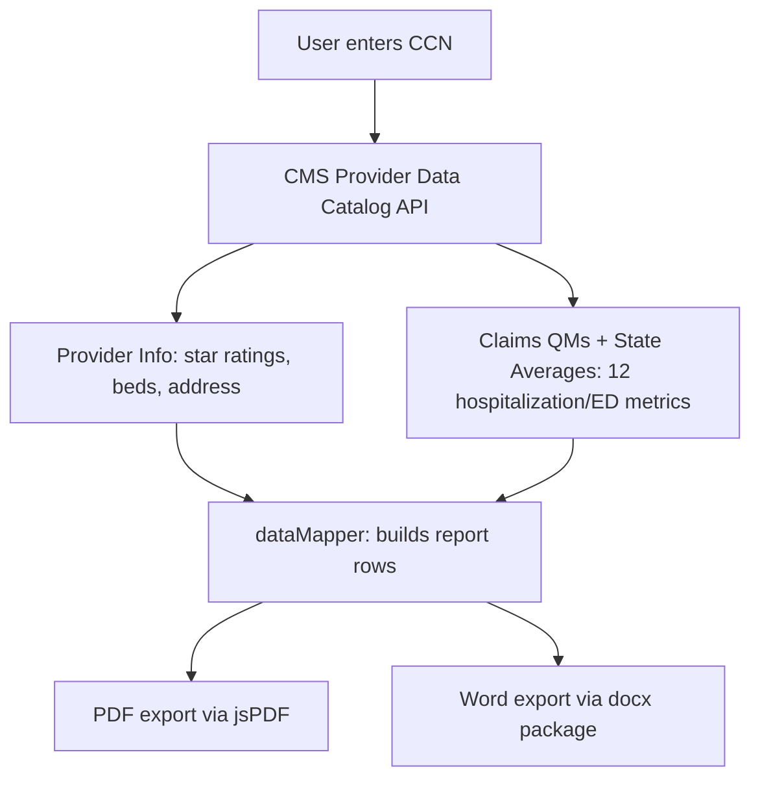

# Facility Assessment Report Generator

Built for the Medelite Healthcare Data Automation & QA Analytics technical case study.

This is a web application that lets a user look up any skilled nursing facility by its CMS Certification Number, fill in internal operational details, and export a polished Facility Assessment Snapshot as a PDF or Word document.

**Live app:** [facility-assessment-generator.netlify.app](https://facility-assessment-generator.netlify.app)

**Test with CCN:** 686123 (Kendall Lakes Healthcare and Rehab Center, Miami, FL)

---

## What it does

- Accepts a 6-character CCN and queries the CMS Provider Data Catalog API for facility data (location, certified beds, star ratings)
- Pulls claims-based hospitalization and ED visit metrics with national and state averages (all 12 lines from the snapshot template)
- Provides manual input fields for internal data not in CMS (EMR system, current census, patient type, Medelite coverage history, medical coverage)
- Supports an optional facility name override that replaces the CMS legal name on all exports
- Generates a PDF matching the Facility Assessment Snapshot layout, with a clickable Medicare Care Compare hyperlink
- Also generates an editable Word (.docx) export
- Displays interactive comparison charts for hospitalization and ED metrics (facility vs. national vs. state)
- Validates input, handles API errors gracefully, and degrades cleanly when claims data is unavailable

The header branding ("INFINITE — Managed by MEDELITE") is hardcoded and never overwritten by facility data.

---

## Tech stack

React 18 with TypeScript, built with Vite, styled with Tailwind CSS. PDF generation uses jsPDF with jsPDF-AutoTable. Word export uses the docx npm package. Charts use Recharts. Deployed on Netlify.

---

## Project structure

| Path | Purpose |
|---|---|
| src/api/cmsApi.ts | CMS API service — builds queries, parses responses, handles column name matching |
| src/components/CCNSearch.tsx | CCN input with 6-character alphanumeric validation |
| src/components/ManualInputs.tsx | Form for EMR, census, patient type, Medelite history fields |
| src/components/FacilityReport.tsx | Main data display — star rating cards, info table, metrics table |
| src/components/MetricsChart.tsx | Recharts bar charts for STR and LT metrics |
| src/components/ErrorBoundary.tsx | React error boundary for unhandled exceptions |
| src/utils/pdfGenerator.ts | Builds the PDF using jsPDF and AutoTable |
| src/utils/docxGenerator.ts | Builds the Word document using the docx package |
| src/utils/dataMapper.ts | Transforms CMS API data + manual inputs into report rows |
| src/types/facility.ts | TypeScript interfaces for all data structures |

---

## How the CMS API integration works

The app queries three public datasets from the CMS Provider Data Catalog (data.cms.gov):

| Dataset | ID | What it provides |
|---|---|---|
| Provider Information | 4pq5-n9py | Facility name, address, beds, star ratings |
| Medicare Claims Quality Measures | ijh5-nb2v | Facility-level hospitalization and ED visit rates |
| State and US Averages | xcdc-v8bm | National and state benchmark values |

Queries go to the /datastore/query/{datasetId}/0 endpoint with condition filters (e.g., filtering by cms_certification_number_ccn or state_or_nation). The dataset IDs are stable across monthly CMS data refreshes, so the app always pulls the latest data without code changes.

CMS truncates long column names with hash suffixes (e.g., a column about short-stay ED visits might end in _d911). The app handles this with multi-keyword partial matching rather than exact column name lookups.

**CORS:** The CMS API does not send Access-Control-Allow-Origin headers, so browsers block direct requests. The app routes API calls through /cms-api/*, which is proxied to data.cms.gov — via Vite's dev server in development and Netlify's rewrite rules (netlify.toml) in production.

---

## CMS field mapping

| Report field | API column |
|---|---|
| Name of Facility | provider_name (with optional manual override) |
| Location | provider_address, citytown, state, zip_code |
| Census Capacity | number_of_certified_beds |
| Star Ratings | overall_rating, health_inspection_rating, staffing_rating, qm_rating |
| Short-term hospitalization/ED | Claims measure codes 521, 522 (adjusted_score) |
| Long-term hospitalization/ED | Claims measure codes 551, 552 (adjusted_score) |
| National/state averages | Matched by partial column name from the State US Averages dataset |

---

## Running locally

Requires Node.js 18+ and npm 9+.

```bash
git clone https://github.com/prasad0411/facility-assessment-generator.git
cd facility-assessment-generator
npm install
npm run dev
```

The dev server starts at http://localhost:5173 with the CORS proxy active.

To build and deploy:

```bash
npm run build
npx netlify-cli deploy --prod --dir=dist
```

---

## Data flow



---

## Engineering decisions and assumptions

**CORS proxy architecture.** Since the CMS API blocks browser-origin requests, I set up a reverse proxy at both layers: Vite's server.proxy config for local development and Netlify's netlify.toml redirects for production. This keeps the frontend simple (all requests go to /cms-api/*) and avoids exposing any secrets since the CMS API is fully public.

**Partial column name matching.** CMS column headers for quality measures are extremely long and get truncated with hash suffixes that change unpredictably. Instead of hardcoding exact column names, the app matches on distinctive keyword fragments (e.g., matching on both "short_stay" and "rehospitalized" to find the right column). This is more resilient than exact matching.

**Graceful degradation.** The claims-based quality measures and state averages are fetched separately from the core provider info. If those calls fail (which happens for newly certified facilities or during CMS maintenance), the app still renders the full facility report with star ratings and manual inputs, and shows a non-blocking warning about the missing metrics.

**Live data vs. reference snapshot.** The app pulls current CMS data, which is refreshed quarterly. Star ratings and metrics will differ from the provided reference PDF (which was from an older snapshot). This is the correct behavior — the app always shows the latest available data.

---

## Test verification

CCN 686123 loads Kendall Lakes Healthcare and Rehab Center in Miami, FL. The Medicare Care Compare link in the PDF opens https://www.medicare.gov/care-compare/details/nursing-home/686123 and matches the facility profile.

Additional CCNs tested: 105447 (FL), 015010 (AL), 335465 (NY). Invalid inputs (000000, ABCDEF, short strings, special characters, empty input) all produce appropriate error messages without crashing.
