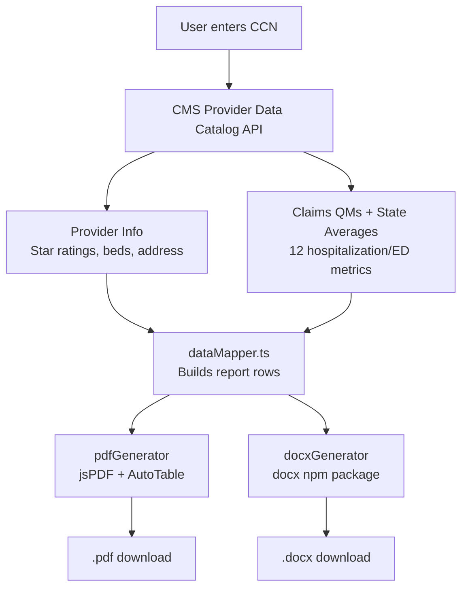

# INFINITE — Facility Assessment Report Generator

**Medelite Technical Case Study Submission**

A lightweight web application that allows Medelite directors to instantly look up any skilled nursing facility by its CMS Certification Number (CCN), combine public CMS data with internal operational notes, and download a polished Facility Assessment Snapshot as a PDF or editable Word document.

---

## Live Demo

**[https://facility-assessment-generator.netlify.app](https://facility-assessment-generator.netlify.app)**

**Test CCN:** 686123 (Kendall Lakes Healthcare and Rehab Center, Miami, FL)

---

## Features

### Core MVP (All Implemented)

| Requirement | Status |
|---|---|
| Dynamic CCN lookup with validation | ✅ |
| CMS Provider Data Catalog API integration | ✅ |
| Facility name override (custom text replaces API name) | ✅ |
| Manual operational inputs (EMR, Census, Patient Type, Medelite History) | ✅ |
| One-click PDF download (clean, print-ready) | ✅ |
| Clickable Medicare Care Compare hyperlink in PDF | ✅ |
| INFINITE — Managed by MEDELITE branding (static, never overwritten) | ✅ |
| Live deployed URL + public repo | ✅ |

### Bonus Features (All Implemented)

| Feature | Status |
|---|---|
| All 12 hospitalization/ED metrics (STR + LT with state and national averages) | ✅ |
| Word document (.docx) export | ✅ |
| Interactive bar charts comparing facility vs. national vs. state metrics | ✅ |
| Advanced error handling (validation, API failures, error boundary, graceful degradation) | ✅ |

---

## Architecture

### Project Structure

| Directory | File | Purpose |
|---|---|---|
| src/api/ | cmsApi.ts | CMS Provider Data Catalog API service |
| src/components/ | Header.tsx | INFINITE / MEDELITE branding |
| | CCNSearch.tsx | CCN input with validation |
| | ManualInputs.tsx | Operational fields form |
| | FacilityReport.tsx | Full data display |
| | StarRating.tsx | Visual 1–5 star cards |
| | MetricsChart.tsx | Recharts bar charts (bonus) |
| | ErrorBoundary.tsx | React error boundary (bonus) |
| src/utils/ | pdfGenerator.ts | jsPDF report builder |
| | docxGenerator.ts | docx Word builder (bonus) |
| | dataMapper.ts | CMS field mapping and formatting |
| src/types/ | facility.ts | TypeScript interfaces |
| src/ | App.tsx | Main application shell |

### Data Flow



### API Integration Strategy

The CMS Provider Data Catalog exposes a public DKAN datastore API. The app queries three datasets using their stable dataset identifiers (which persist across monthly data refreshes):

| Dataset | ID | Data |
|---|---|---|
| Provider Information | 4pq5-n9py | Location, beds, star ratings |
| Claims Quality Measures | ijh5-nb2v | Hospitalization/ED facility rates |
| State and US Averages | xcdc-v8bm | National and state benchmarks |

**Query approach:** The app uses the datastore/query endpoint with condition parameters to filter by CCN or state. Column names from the CMS API use snake_case (e.g., cms_certification_number_ccn, overall_rating), and the app performs case-insensitive plus partial keyword matching to handle CMS's truncated column names for long quality measure fields.

**CORS handling:** The CMS API does not set Access-Control-Allow-Origin headers, so direct browser requests are blocked. The app solves this with a reverse proxy — Vite's dev server proxy in development and Netlify's netlify.toml rewrite rules in production — routing /cms-api/* requests through the hosting layer to data.cms.gov.

**Graceful degradation:** If claims-based data fails to load, the core MVP (provider info + star ratings) still displays and exports correctly, with a non-blocking warning shown to the user.

### CMS Field Mapping

| Report Label | CMS API Column | Source |
|---|---|---|
| Name of Facility | provider_name | API (with manual override) |
| Location | provider_address + citytown + state + zip_code | API |
| Census Capacity | number_of_certified_beds | API |
| Overall Star Rating | overall_rating | API |
| Health Inspection | health_inspection_rating | API |
| Staffing | staffing_rating | API |
| Quality of Resident Care | qm_rating | API |
| STR metrics | Claims measure codes 521, 522 | API |
| LT metrics | Claims measure codes 551, 552 | API |
| Averages | State US Averages (by state code + NATION) | API |

---

## Tech Stack

| Layer | Technology | Why |
|---|---|---|
| Framework | React 18 + TypeScript | Type safety, component model |
| Build | Vite 6 | Fast HMR, optimal production builds |
| Styling | Tailwind CSS 3.4 | Utility-first, no CSS-in-JS overhead |
| PDF Export | jsPDF + jsPDF-AutoTable | Client-side PDF generation |
| DOCX Export | docx (npm) + file-saver | Client-side Word generation |
| Charts | Recharts | Declarative React charting |
| Deployment | Netlify | Global CDN, reverse proxy via rewrites |

---

## Getting Started

### Prerequisites

Node.js 18+ and npm 9+

### Install and Run

```bash
git clone https://github.com/prasad0411/facility-assessment-generator.git
cd facility-assessment-generator
npm install
npm run dev
```

Open http://localhost:5173 and test with CCN 686123.

### Build and Deploy

```bash
npm run build
npx netlify-cli deploy --prod --dir=dist
```

---

## Test Verification

Use CCN **686123** to verify against **Kendall Lakes Healthcare and Rehab Center**:

| Field | Expected Source |
|---|---|
| Name | provider_name from CMS API (live data) |
| Location | 5280 SW 157 Avenue, Miami, FL |
| Census Capacity | number_of_certified_beds from CMS API |
| Star Ratings | overall_rating, health_inspection_rating, staffing_rating, qm_rating |
| STR/LT Metrics | Claims measures 521, 522, 551, 552 with state/national benchmarks |
| Medicare Link | https://www.medicare.gov/care-compare/details/nursing-home/686123 |

> **Note:** Star ratings and metrics reflect **current live CMS data**, which is updated quarterly. Values may differ from older reference snapshots — this is expected and correct behavior.

---

## Engineering Assumptions

1. **CORS proxy:** The CMS data.cms.gov API does not include CORS headers for browser requests. A reverse proxy (/cms-api/* to data.cms.gov/provider-data/api/1/*) is configured in both Vite dev server (vite.config.ts) and Netlify production (netlify.toml). No API keys or secrets are required.

2. **Stable dataset IDs:** CMS dataset identifiers (4pq5-n9py, etc.) are stable across monthly data refreshes. The underlying data updates automatically without code changes.

3. **Claims data availability:** Some facilities may lack claims-based quality measures. The app degrades gracefully — the core report generates with star ratings and manual inputs, while showing a non-blocking warning about unavailable claims data.

4. **Column name handling:** CMS truncates long column names with hash suffixes. The app uses multi-keyword partial matching to reliably resolve these fields.

5. **Branding guardrail:** The INFINITE brand text in the header and exports is hardcoded and never programmatically replaced by facility data, per the case study requirements.

---

## License

Built for the Medelite Technical Case Study.
